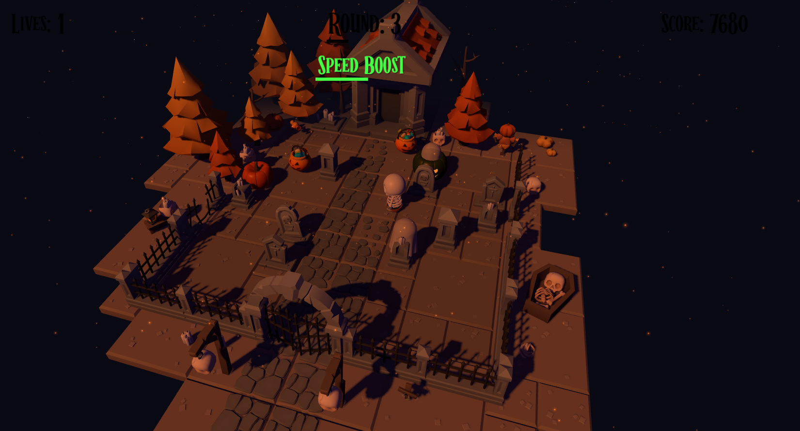

# 👻 Ghost Dodger

A spooky Halloween-themed 3D arcade game where you control a pumpkin character dodging ghosts, collecting candy, and surviving as long as possible!



## 🎮 How to Play

### Controls

**Desktop:**
- **W / ↑** - Move Up
- **A / ←** - Move Left
- **S / ↓** - Move Down
- **D / →** - Move Right

**Mobile:**
- Use the **on-screen D-Pad** to move in all directions

### Objective

- **Dodge ghosts** and other spooky enemies
- **Collect candy** to increase your score
- **Grab power-ups** for special abilities:
  - 🟢 **Speed Boost** - Move faster temporarily
  - 🔴 **Invulnerability** - Become immune to damage
  - 🔵 **Slow Enemies** - Enemies move slower
- **Build combos** by collecting items quickly for score multipliers
- **Defeat bosses** that appear every 5 rounds
- **Survive** as many rounds as possible to climb the leaderboard!

## 🏆 Features

- **10 Unlockable Achievements** - Complete challenges to unlock all achievements
- **Leaderboard System** - Compete for the highest score
- **Boss Battles** - Face off against giant Evil Pumpkin bosses
- **Combo System** - Chain collections for up to 5x score multiplier
- **Progressive Difficulty** - Each round gets more challenging
- **Particle Effects** - Satisfying visual feedback
- **Screen Shake** - Dynamic camera effects on impacts

## 🎯 Tips

1. **Master the combo system** - Collect items quickly to build your multiplier
2. **Save power-ups** - Use invulnerability when surrounded by enemies
3. **Watch for patterns** - Enemies move in predictable ways
4. **Boss strategy** - Keep moving and attack when safe
5. **No damage rounds** - Complete 3 rounds without damage for an achievement

## 🚀 Getting Started

```bash
# Install dependencies
npm install

# Run development server
npm run dev

# Build for production
npm run build
```

## 🎨 Credits

Built with:
- **Three.js** - 3D graphics
- **Black Engine** - Game logic and UI
- **Vite** - Build tool


**Good luck, and happy dodging!** 👻
